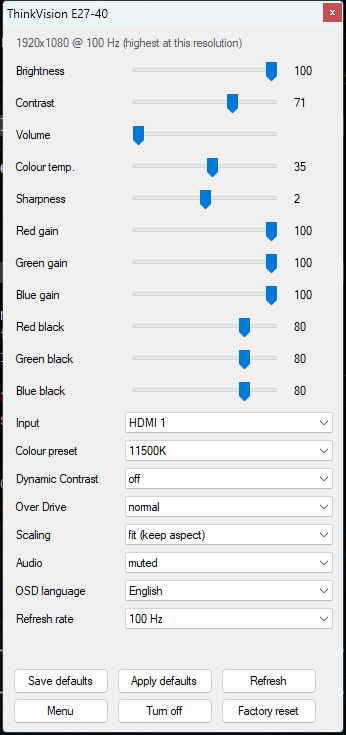
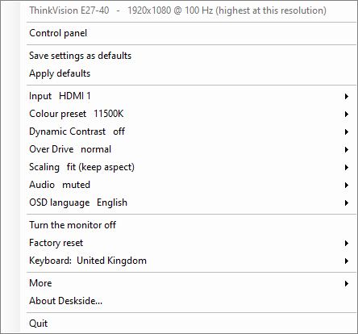
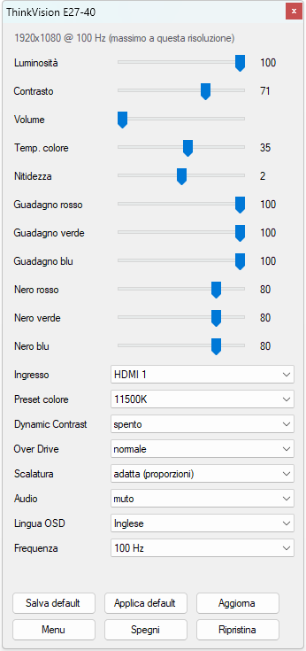
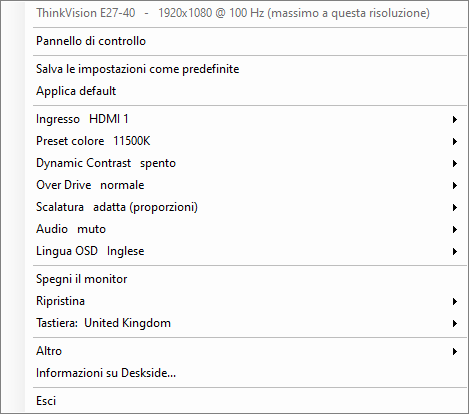

# Deskside

**Your desk, the way you left it.**

> 🇮🇹 Anche **[in italiano](#deskside-italiano)**.

A Windows tray utility for laptops that live on a dock.

**It is not tied to the hardware it was written for.** Deskside asks each
monitor what it supports instead of assuming, so any DDC/CI display and any USB
keyboard should work.

No installer, no service, no dependencies. One executable, built from source in
about a second by the C# compiler already present on every Windows machine.
English and Italian.

## How it looks

| Control panel | Menu |
|---|---|
|  |  |

Shortcuts leave a readout on screen that never steals focus:


---

## Why

Two annoyances, one tray icon.

**The monitor.** Its brightness, contrast, input and colour settings live behind
a joystick nub on the back of the panel. Every DDC/CI monitor exposes them to
software — Windows just ships no interface for it.

**The keyboard.** Plug in a keyboard with a different layout and Windows still
resets to your account's default language on every lock, unlock and login.
Deskside notices which keyboard is attached and puts the right layout back.

---

## What it does

**Monitor.** Brightness, contrast, volume, colour temperature, sharpness, RGB
gain and black level, input source, colour preset, scaling, mute, OSD language,
power, factory resets. On Dell panels, the OSD preset modes too (Standard, FPS,
RTS, RPG, Game 1–3, ComfortView, Warm, Cool, Custom Color). Refresh rate and
orientation as well, though those two go through Windows rather than DDC/CI.

**Profiles.** Save your settings as the defaults for *that* monitor, keyed by its
PnP id. Plug a different one in and Deskside recognises it and applies the right
profile. A laptop that moves between two desks keeps two profiles and needs no
attention.

**Discovery.** Nothing about your monitor is assumed. Each time one appears,
Deskside re-enumerates it, reads its capabilities, then **probes the VCP codes
one at a time and keeps the ones that answer** — a failed read is retried, since
a monitor that has just re-locked its signal drops packets — rebuilds the panel
from what it found, and applies the saved profile. So a different monitor gets a
different set of controls, with nothing to configure. What you see is what your
hardware answered to, which includes controls it forgets to declare and excludes
ones it declares but never implements.

**Keyboard.** Detects connected USB keyboards, maps each to an input layout, and
restores that layout on plug-in, on unlock, on login and — optionally — every few
seconds while the keyboard is attached. The built-in laptop keyboard is left
alone.

**Language.** Follows the Windows display language, falling back to English for
anything that is not Italian. Pin it from *More → Language*.

### Shortcuts

| Keys | Action |
|---|---|
| `Ctrl+Alt+Up` / `Down` | brightness ±5 |
| `Ctrl+Shift+Alt+Up` / `Down` | contrast ±5 |
| `Ctrl+Alt+Right` / `Left` | volume ±5 |
| `Ctrl+Alt+M` | mute |
| `Ctrl+Alt+I` | next input |
| `Ctrl+Alt+PageDown` | open the panel |

---

## Install

Download `Deskside.exe` from [Releases][releases] and run it, then
*More → Start with Windows*. Or build it:

```
git clone https://github.com/GiovanniCst/deskside
cd deskside
build.cmd
```

`build.cmd` calls `C:\Windows\Microsoft.NET\Framework64\v4.0.30319\csc.exe`, the
compiler shipped with the .NET Framework. No SDK, no package restore, no project
file.

**Requires** Windows 10 or 11 and a monitor with DDC/CI enabled in its own menu —
on by default for most, off on a few.

## Using it

Left-click the tray icon for the panel; right-click it, or use the panel's
**Menu** button, for everything else. The icon appears only while a DDC/CI
monitor is connected.

Set a monitor up the way you like it and press **Save defaults**. The profile is
re-applied when the monitor *changes*, not on a manual *Refresh*, so it never
overwrites what you are adjusting.

For a keyboard: *Keyboard* → pick it → pick a layout. **Keep the layout
enforced** (default) re-checks every four seconds and fixes the unlock problem
outright, at the cost of not letting you switch layouts by hand while that
keyboard is plugged in.

Settings live in `%APPDATA%\Deskside\settings.ini`, plain text, safe to edit:

```ini
[app]
keepLayout=1
language=auto

[keyboards]
VID_2F68&PID_0082=00000809

[LEN64BC]
name=ThinkVision E27-40
0x10=100
```

---

## How it works

**The bus is slow, and that shapes everything.** Each DDC/CI read or write costs
about **60 ms**, and no cleverness makes it faster; a full panel refresh is a
dozen reads. So all bus traffic runs on one background thread, writes to the same
code coalesce (drag a slider and only the value you land on is sent), queued
reads for the same code merge — but never across a write of that code still
waiting, or the verification would read the old value and cry rejection over a
command that worked — and controls move immediately and correct themselves when
the answer arrives. The mirror case is covered too: a refresh read queued
*before* your write comes back with the old value, legitimately, and is not
allowed to drag the slider back while the verification is pending. Shortcuts
work from the cache rather than reading first, which is why they feel instant.

**Monitors lie about what they support.** The ThinkVision this was written
against declares 30 VCP codes and answers to 43 — sharpness, mute and the three
black-level controls all work while going undeclared. Hence probing rather than
trusting the declared list. *More → Full VCP scan* sweeps all 256 codes read-only
and reports what answers; *Diagnostics* goes further and tests which ones accept
writes, restoring the original value.

**And some monitors answer everything.** A Dell S2719DGF replies to all 256
codes, including ones that do not exist, by repeating its last valid reply. Taken
at face value it owns every control in the standard, and the invented ones then
sit in the panel empty, because the value read belongs to another code. So before
probing, Deskside reads a reserved sentinel code. If that answers, a stricter
rule applies for this monitor: a code is real only if its reply differs from the
last one received. It costs no extra reads — after any read the echo is that
reply — and on an honest monitor nothing changes. The full scan lists the echoes
separately rather than counting them as features.

Two corners of that rule. A real code whose value happens to equal the echo —
three RGB gains at 100 in a row — is re-asked after priming the echo with a code
already promoted; if none has been yet, it is set aside and re-asked at the end
instead of guessed. And another program reading the monitor at the same time
(Dell Display Manager, a measurement script) changes the echo under Deskside's
feet, so every code looks "different from the one before" and gets promoted.
Since the echo is by definition the last valid reply, the sentinel is re-read
when the probe ends: if it does not match, someone else is on the bus, the probe
is redone, and after three tries Deskside says so rather than show a panel built
from someone else's answers.

**And a control can be read on one code and set on another.** That Dell reports
its OSD preset (Standard, FPS, Game 1…) on vendor code `0xE2`, which it declares
with all eleven values — and writes to it are accepted and ignored. Sniffing
Dell's own manager (`tools\Sniff-Ddc.py` hooks its DDC/CI calls) showed no
secret channel, just three other registers: Standard and Game 1 go through the
standard Display Application code, the game modes and ComfortView through vendor
`0xF0`, Warm, Cool and Custom through the standard colour preset. Deskside reads
`0xE2`, writes the register the choice calls for, and verifies on `0xE2` again.
Response Time, Dark Stabilizer and Game Enhance Mode, on the other hand, move no
code at all when changed from the OSD — they are simply not on the bus, which
is why Dell's manager does not offer them either.

**One more thing that trips up dropdowns.** On non-continuous codes the value
lives in the low byte; the high byte is reserved, and some monitors fill it in
anyway. That Dell answers `0x1212` for HDMI 2 — the right answer, `0x12`, sent
twice. Unmasked, no entry in the list matches and the box stays blank even for a
control the monitor really has.

**A monitor can accept a command and ignore it.** That is a mode in its own menu
holding the control fixed — on the E27-40, Dynamic Contrast freezes brightness
and contrast, an sRGB preset freezes contrast, and any named preset freezes
colour temperature. Deskside notices by reading the value back: about 700 ms
after a change, a verification read fires and the control snaps back with an
explanation. Applying a profile writes Dynamic Contrast and the colour preset
first, or everything after them would be ignored.

**A keyboard will not tell you its layout.** USB HID has a field for it,
`bCountryCode`, and it reads `0` on essentially every keyboard sold — and Windows
does not expose it anyway, neither under `Enum\HID` nor in
`HID_COLLECTION_INFORMATION`. `tools/Get-HidCountryCode.ps1` asks the hardware
directly, walking the USB hubs and pulling the HID descriptors out of the
configuration descriptor via `IOCTL_USB_GET_DESCRIPTOR_FROM_NODE_CONNECTION`. It
will print `0`. That is why the mapping is manual and saved.

**Vendor codes are brand-specific.** `0xE0` and `0xEA` are Over Drive and Dynamic
Contrast *on Lenovo monitors*, established by experiment rather than
documentation. Elsewhere those numbers could mean anything, so they are offered
only when the PnP id starts with `LEN`. Identified some on your hardware? A pull
request adding them behind the same guard is welcome.

**One trap worth passing on.** WMI's `WmiMonitorListedSupportedSourceModes`
reports only 1920x1080 @ 60 Hz for this monitor, while the driver offers 50, 59,
60, 75 and **100 Hz** at that resolution. That table holds the EDID's standard
timings, not the detailed timings where the high rates live. Deskside uses
`EnumDisplaySettings` instead.

## Compatibility

Written against a Lenovo ThinkVision E27-40, a Dell S2719DGF and a Durgod Taurus
K320, but nothing is specific to them beyond the vendor codes above. Any DDC/CI monitor and any USB
keyboard should work, since the whole design asks the hardware rather than
assuming. Reports from other hardware — especially the output of *Full VCP scan* —
are welcome in the issues.

## Licence

[Apache 2.0](LICENSE). Use, modify and redistribute it, including commercially,
provided the copyright and attribution notices are kept — see [NOTICE](NOTICE).
Derivative works must credit the original author and state that they changed it.

Created by **Giovanni J. Costantini** — [costantini.pw](https://costantini.pw)

[releases]: https://github.com/GiovanniCst/deskside/releases

<br>

---
---

<br>

# Deskside (italiano)

**La tua scrivania, come l'avevi lasciata.**

> 🇬🇧 Also **[in English](#deskside)**.

Una utility per la tray di Windows, per i portatili che vivono in postazione.

**Non è legato all'hardware per cui è stato scritto.** Deskside chiede a ogni
monitor cosa supporta invece di darlo per scontato, quindi qualsiasi schermo
DDC/CI e qualsiasi tastiera USB dovrebbero funzionare.

Niente installer, niente servizio, nessuna dipendenza. Un solo eseguibile,
compilato dai sorgenti in circa un secondo dal compilatore C# già presente in
ogni installazione di Windows. Inglese e italiano.

## Com'è fatto

| Pannello di controllo | Menu |
|---|---|
|  |  |

Le scorciatoie lasciano a schermo un indicatore che non ruba mai il fuoco:


---

## Perché

Due fastidi, una sola icona nella tray.

**Il monitor.** Luminosità, contrasto, ingresso e colore stanno dietro a un
levettino sul retro del pannello. Ogni monitor DDC/CI li espone via software:
è Windows che non offre nessuna interfaccia.

**La tastiera.** Colleghi una tastiera con un layout diverso e Windows continua a
rimettere la lingua predefinita dell'account a ogni blocco, sblocco e login.
Deskside riconosce quale tastiera è collegata e rimette il layout giusto.

---

## Cosa fa

**Monitor.** Luminosità, contrasto, volume, temperatura colore, nitidezza,
guadagno e livello del nero RGB, ingresso, preset colore, scalatura, muto, lingua
dell'OSD, spegnimento, ripristini di fabbrica. Sui Dell anche i preset dell'OSD
(Standard, FPS, RTS, RPG, Game 1–3, ComfortView, Caldo, Freddo, Colore
personalizzato). E frequenza di aggiornamento e orientamento, che però passano
da Windows e non dal DDC/CI.

**Profili.** Salvi le impostazioni come predefinite di *quel* monitor, sotto il
suo codice PnP. Ne colleghi un altro e Deskside lo riconosce e applica il profilo
giusto. Un portatile che gira fra due scrivanie tiene due profili e non chiede
attenzione.

**Scoperta.** Del monitor non si dà per scontato niente. Ogni volta che ne
compare uno, Deskside lo rienumera, ne legge le capability, poi **interroga i
codici VCP uno per uno e tiene quelli che rispondono** — una lettura fallita
viene ritentata, perché un monitor che ha appena ri-agganciato il segnale perde
pacchetti — ricostruisce il pannello su quello che ha trovato e applica il
profilo salvato. Così un monitor diverso ottiene controlli diversi, senza niente
da configurare. Vedi ciò a cui il tuo hardware ha risposto: compresi i controlli
che si dimentica di dichiarare, esclusi quelli che dichiara ma non implementa.

**Tastiera.** Rileva le tastiere USB collegate, associa a ciascuna un layout e lo
rimette al collegamento, allo sblocco, al login e — se vuoi — ogni pochi secondi
finché la tastiera resta collegata. La tastiera integrata viene lasciata in pace.

**Lingua.** Segue la lingua di Windows e ricade sull'inglese per tutto ciò che
non è italiano. La fissi da *Altro → Lingua*.

### Scorciatoie

| Tasti | Effetto |
|---|---|
| `Ctrl+Alt+Su` / `Giù` | luminosità ±5 |
| `Ctrl+Shift+Alt+Su` / `Giù` | contrasto ±5 |
| `Ctrl+Alt+Destra` / `Sinistra` | volume ±5 |
| `Ctrl+Alt+M` | muto |
| `Ctrl+Alt+I` | ingresso successivo |
| `Ctrl+Alt+PagGiù` | apre il pannello |

---

## Installazione

Scarica `Deskside.exe` dalle [Release][releases] e avvialo, poi
*Altro → Avvia con Windows*. Oppure compilalo:

```
git clone https://github.com/GiovanniCst/deskside
cd deskside
build.cmd
```

`build.cmd` chiama `C:\Windows\Microsoft.NET\Framework64\v4.0.30319\csc.exe`, il
compilatore incluso nel .NET Framework. Nessun SDK, nessun ripristino di
pacchetti, nessun file di progetto.

**Richiede** Windows 10 o 11 e un monitor con il DDC/CI abilitato nel suo menu:
attivo di serie quasi ovunque, spento su qualche modello.

## Come si usa

Clic sinistro sull'icona per il pannello; clic destro, o il pulsante **Menu** del
pannello, per tutto il resto. L'icona compare solo quando c'è un monitor DDC/CI
collegato.

Regola il monitor come ti piace e premi **Salva default**. Il profilo si riapplica
quando il monitor *cambia*, non su un *Aggiorna* manuale, così non sovrascrive
mai quello che stai regolando.

Per la tastiera: *Tastiera* → scegli quale → scegli il layout. **Mantieni il
layout forzato** (attivo di default) ricontrolla ogni quattro secondi e risolve
del tutto il problema dello sblocco, al prezzo di non lasciarti cambiare layout a
mano finché quella tastiera è collegata.

Le impostazioni stanno in `%APPDATA%\Deskside\settings.ini`, in chiaro e
modificabili:

```ini
[app]
keepLayout=1
language=auto

[keyboards]
VID_2F68&PID_0082=00000809

[LEN64BC]
name=ThinkVision E27-40
0x10=100
```

---

## Come funziona

**Il bus è lento, e questo determina tutto.** Ogni lettura o scrittura DDC/CI
costa circa **60 ms**, e nessuna astuzia lo accelera; un aggiornamento completo
del pannello sono una dozzina di letture. Perciò tutto il traffico sta su un
thread di lavoro, le scritture sullo stesso codice si fondono (trascini un
cursore e parte solo il valore su cui ti fermi), le letture in coda per lo stesso
codice si uniscono — mai però scavalcando una scrittura di quel codice ancora in
attesa, altrimenti la verifica leggerebbe il valore vecchio e griderebbe al
rifiuto per un comando riuscito — e i controlli si muovono subito correggendosi
quando arriva la risposta. Vale anche il caso speculare: una lettura di
aggiornamento accodata *prima* della tua scrittura torna col valore vecchio,
legittimamente, e non le è permesso riportare indietro il cursore finché la
verifica è in sospeso. Le scorciatoie partono dalla cache invece di rileggere:
per questo rispondono all'istante.

**I monitor mentono su cosa supportano.** Il ThinkVision su cui è nato ne
dichiara 30 di codici VCP e ne risponde 43: nitidezza, muto e i tre livelli del
nero funzionano pur non essendo dichiarati. Da qui la scelta di interrogare invece
di fidarsi. *Altro → Scansione completa* passa tutti e 256 i codici in sola
lettura e riporta cosa risponde; *Diagnostica* va oltre e prova quali accettano
le scritture, ripristinando il valore originale.

**E qualcuno risponde a tutto.** Un Dell S2719DGF risponde a tutti e 256 i
codici, anche a quelli che non esistono, ripetendo l'ultima risposta valida.
Preso alla lettera possiede ogni controllo dello standard, e quelli inventati
restano poi vuoti nel pannello, perché il valore letto appartiene a un altro
codice. Perciò prima di sondare Deskside legge un codice sentinella riservato. Se
quello risponde, per quel monitor vale una regola più stretta: un codice è reale
solo se la sua risposta è diversa dall'ultima ricevuta. Non costa letture in più
— dopo una lettura l'eco è quella risposta — e su un monitor onesto non cambia
nulla. La scansione completa elenca le eco a parte invece di contarle come
funzioni.

Due angoli di quella regola. Un codice reale il cui valore coincide per caso con
l'eco — tre guadagni RGB a 100 di fila — viene richiesto dopo aver innescato
l'eco con un codice già promosso; se non ce n'è ancora nessuno, viene messo da
parte e richiesto alla fine invece di tirare a indovinare. E un altro programma
che legge il monitor nello stesso momento (Dell Display Manager, uno script di
misura) cambia l'eco sotto i piedi di Deskside: ogni codice sembra «diverso dal
precedente» e viene promosso. Siccome l'eco è per definizione l'ultima risposta
valida, a fine sondaggio la sentinella viene riletta: se non coincide, qualcuno
è sul bus, il sondaggio si ripete, e dopo tre tentativi Deskside lo dice invece
di mostrare un pannello costruito sulle risposte di un altro.

**E un controllo si può leggere su un codice e impostare su un altro.** Quel
Dell riporta il preset dell'OSD (Standard, FPS, Game 1…) sul codice vendor
`0xE2`, che dichiara con tutti gli undici valori — e le scritture le accetta e
le ignora. Sniffando il manager di Dell (`tools\Sniff-Ddc.py` aggancia le sue
chiamate DDC/CI) non è uscito nessun canale segreto, solo tre altri registri:
Standard e Game 1 passano dal codice standard Display Application, le modalità
gioco e ComfortView dal vendor `0xF0`, Caldo, Freddo e Personalizzato dal preset
colore standard. Deskside legge `0xE2`, scrive il registro che la scelta
richiede, e verifica di nuovo su `0xE2`. Response Time, Dark Stabilizer e Game
Enhance Mode invece non muovono nessun codice quando li cambi dall'OSD: non
sono sul bus, ed è per questo che nemmeno il manager di Dell li offre.

**Un'altra cosa che svuota gli elenchi.** Sui codici non continui il valore sta
nel byte basso; il byte alto è riservato, e c'è chi lo riempie lo stesso. Quel
Dell risponde `0x1212` per HDMI 2: la risposta giusta, `0x12`, mandata due volte.
Senza mascherarlo nessuna voce dell'elenco corrisponde, e la casella resta vuota
anche per un controllo che il monitor ha davvero.

**Un monitor può accettare un comando e ignorarlo.** È una modalità del suo menu
che tiene fisso quel controllo: sull'E27-40 il Dynamic Contrast congela
luminosità e contrasto, il preset sRGB congela il contrasto, e qualsiasi preset
nominale congela la temperatura colore. Deskside se ne accorge rileggendo: circa
700 ms dopo una modifica parte una rilettura di verifica e il controllo torna
indietro spiegando perché. Applicando un profilo scrive per primi Dynamic
Contrast e preset colore, altrimenti tutto il resto verrebbe ignorato.

**Una tastiera non ti dice che layout ha.** L'USB HID ha un campo apposta,
`bCountryCode`, e vale `0` praticamente su ogni tastiera in commercio — e
comunque Windows non lo espone, né sotto `Enum\HID` né in
`HID_COLLECTION_INFORMATION`. `tools/Get-HidCountryCode.ps1` lo chiede
direttamente all'hardware, percorrendo gli hub USB ed estraendo i descrittori HID
dal configuration descriptor con
`IOCTL_USB_GET_DESCRIPTOR_FROM_NODE_CONNECTION`. Stamperà `0`. Ecco perché
l'associazione è manuale e viene salvata.

**I codici vendor valgono solo per la loro marca.** `0xE0` e `0xEA` sono Over
Drive e Dynamic Contrast *sui monitor Lenovo*, stabilito provandoli e non
leggendo una documentazione. Altrove quei numeri possono voler dire qualunque
cosa, quindi vengono proposti solo se il codice PnP inizia per `LEN`. Ne hai
identificati sul tuo hardware? Una pull request che li aggiunge dietro alla stessa
guardia è benvenuta.

**Una trappola da tramandare.** La classe WMI
`WmiMonitorListedSupportedSourceModes` per questo monitor dichiara solo
1920x1080 @ 60 Hz, mentre il driver a quella risoluzione offre 50, 59, 60, 75 e
**100 Hz**. Quella tabella contiene le timing standard dell'EDID, non le detailed
timing dove stanno le frequenze alte. Deskside usa `EnumDisplaySettings`.

## Compatibilità

Nato su un Lenovo ThinkVision E27-40, un Dell S2719DGF e una Durgod Taurus K320,
ma niente è
specifico di quei due oltre ai codici vendor di cui sopra. Qualsiasi monitor
DDC/CI e qualsiasi tastiera USB dovrebbero funzionare, visto che tutto il
progetto chiede all'hardware invece di dare per scontato. Segnalazioni da altro
hardware — soprattutto l'output della *Scansione completa* — sono benvenute nelle
issue.

## Licenza

[Apache 2.0](LICENSE). Puoi usarlo, modificarlo e ridistribuirlo, anche
commercialmente, purché restino le note di copyright e attribuzione — vedi
[NOTICE](NOTICE). Le opere derivate devono citare l'autore originale e dichiarare
di averlo modificato.

Creato da **Giovanni J. Costantini** — [costantini.pw](https://costantini.pw)
